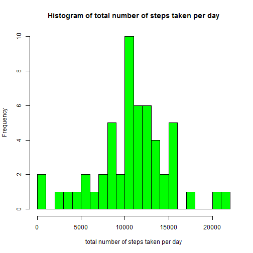
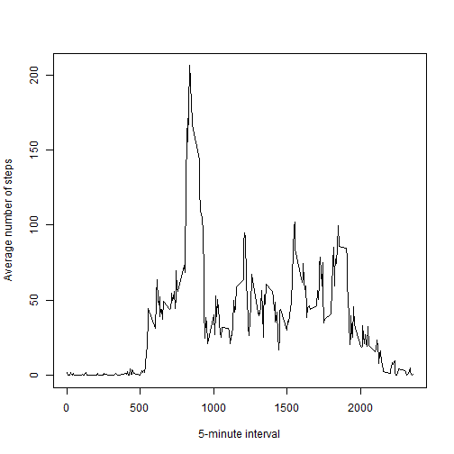
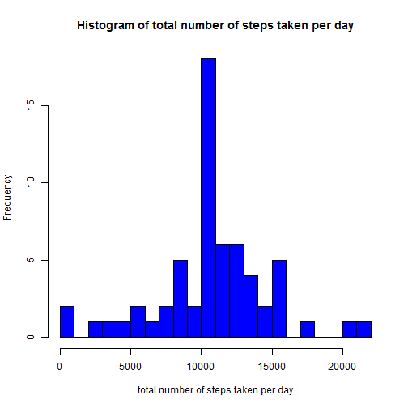
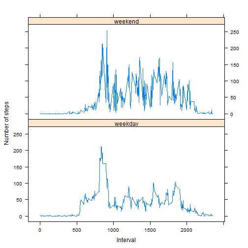

##Loading and preprocessing the data

Load the data:

```r
activity<-read.csv("activity.csv", stringsAsFactors=FALSE)
```

General information about data:

```r
head(activity)
```

```
##   steps       date interval
## 1    NA 2012-10-01        0
## 2    NA 2012-10-01        5
## 3    NA 2012-10-01       10
## 4    NA 2012-10-01       15
## 5    NA 2012-10-01       20
## 6    NA 2012-10-01       25
```

```r
str(activity)
```

```
## 'data.frame':	17568 obs. of  3 variables:
##  $ steps   : int  NA NA NA NA NA NA NA NA NA NA ...
##  $ date    : chr  "2012-10-01" "2012-10-01" "2012-10-01" "2012-10-01" ...
##  $ interval: int  0 5 10 15 20 25 30 35 40 45 ...
```

Transform the data into a format suitable for analysis:

```r
activity$date<-as.Date(activity$date)
```

##What is mean total number of steps taken per day?

Calculate the total number of steps taken per day:

```r
Stepsperday<-aggregate(activity$steps,list(activity$date),sum)
```

Histogram of the total number of steps taken each day:

```r
hist(Stepsperday[,2],breaks=20,xlab="total number of steps taken per day",main="Histogram of total number of steps taken per day",col="green")
```

 

The mean and median of the total number of steps taken per day:

```r
n_mean<-mean(Stepsperday[,2],na.rm=TRUE)
n_median<-median(Stepsperday[,2],na.rm=TRUE)
```
Mean total number of steps taken per day is 1.0766189 &times; 10<sup>4</sup>.Median is 10765.

##What is the average daily activity pattern?

Time series plot of the 5-minute interval (x-axis) and the average number of steps taken, averaged across all days (y-axis):

```r
forplot<-aggregate(activity$steps,list(activity$interval),mean,na.rm=TRUE)
plot(forplot,type="l",xlab="5-minute interval",ylab="Average number of steps")
```

 

Which 5-minute interval, on average across all the days in the dataset, contains the maximum number of steps?

```r
maxsteps<-forplot[which(forplot[,2]==max(forplot[,2]),arr.ind=TRUE),1]
```
The interval with the maxium number of steps across all days is 835.

##Imputing missing values

The total number of missing values in the dataset:

```r
sum(is.na(activity))
```

```
## [1] 2304
```

Create a new dataset that is equal to the original dataset but with the missing data filled in. The mean for that 5-minute interval is a strategy for filling in all of the missing values in the dataset.

```r
activity_new<-activity
for (i in 1:dim(activity_new)[1]){
  if(is.na(activity_new[i,1])){
    activity_new[i,1]<-round(forplot[which(forplot[,1]==activity_new[i,3]),2])
  }
}
```

General information about new dataset:

```r
head(activity_new)
```

```
##   steps       date interval
## 1     2 2012-10-01        0
## 2     0 2012-10-01        5
## 3     0 2012-10-01       10
## 4     0 2012-10-01       15
## 5     0 2012-10-01       20
## 6     2 2012-10-01       25
```

```r
str(activity_new)
```

```
## 'data.frame':	17568 obs. of  3 variables:
##  $ steps   : num  2 0 0 0 0 2 1 1 0 1 ...
##  $ date    : Date, format: "2012-10-01" "2012-10-01" ...
##  $ interval: int  0 5 10 15 20 25 30 35 40 45 ...
```

Make a histogram of the total number of steps taken each day:

```r
Stepsperday_new<-aggregate(activity_new$steps,list(activity_new$date),sum)
hist(Stepsperday_new[,2],breaks=20,xlab="total number of steps taken per day",main="Histogram of total number of steps taken per day",col="blue")
```

 

Calculate the mean and median total number of steps taken per day:

```r
n_mean_new<-mean(Stepsperday_new[,2])
n_median_new<-median(Stepsperday_new[,2])
```
Mean total number of steps taken per day is 1.0765639 &times; 10<sup>4</sup>. Median is 1.0762 &times; 10<sup>4</sup>.

Do these values differ from the estimates from the first part of the assignment?

```r
n_mean-n_mean_new
```

```
## [1] 0.549335
```


```r
n_median-n_median_new
```

```
## [1] 3
```
The imputing missing data on the estimates of the total daily number of steps leads to decrease the mean and median values.

##Are there differences in activity patterns between weekdays and weekends?

Create a new factor variable in the dataset with two levels - "weekday" and "weekend" indicating whether a given date is a weekday or weekend day:

```r
activity_new$weekday<-factor(weekdays(activity_new$date)==c("Sunday","Saturday"),levels=c(FALSE,TRUE),labels=c("weekday","weekend"))
head(activity_new)
```

```
##   steps       date interval weekday
## 1     2 2012-10-01        0 weekday
## 2     0 2012-10-01        5 weekday
## 3     0 2012-10-01       10 weekday
## 4     0 2012-10-01       15 weekday
## 5     0 2012-10-01       20 weekday
## 6     2 2012-10-01       25 weekday
```

Make a panel plot containing a time series plot of the 5-minute interval (x-axis) and the average number of steps taken, averaged across all weekday days or weekend days (y-axis):

```r
forplot_new<-aggregate(activity_new$steps,list(activity_new$interval,activity_new$weekday),mean)
library(lattice)
xyplot(forplot_new[,3]~forplot_new[,1] | forplot_new[,2],type="l",layout=c(1,2),xlab="Interval",ylab="Number of steps")
```

 
